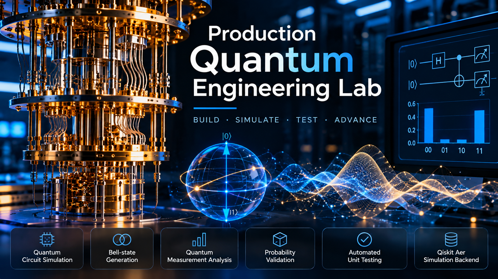

# Production Quantum Engineering Lab

## Overview

Production Quantum Engineering Lab is a Python-based quantum computing project focused on building, simulating, and testing quantum circuits using Qiskit.

The project explores foundational quantum engineering techniques with an emphasis on modular code, reproducible simulations, and automated testing.

## Features

- Quantum circuit simulation
- Bell-state generation
- Quantum measurement analysis
- Probability validation
- Automated unit testing
- Qiskit Aer simulation backend

## Technologies

- Python
- Qiskit
- Qiskit Aer
- Git and GitHub
- Python unittest

## Project Structure

```text
production-quantum-engineering-lab/
├── quantum_engine.py
├── test_quantum_engine.py
└── README.md
```

## Installation

Install the required Python packages:

```bash
pip install qiskit qiskit-aer
```

## Run the Quantum Engine

```bash
python quantum_engine.py
```

## Run Automated Tests

```bash
python test_quantum_engine.py
```

## Validation

The initial Bell-state simulation and probability tests have passed successfully.

The project currently includes two passing automated tests.

## Future Development

Planned improvements include:

- Quantum noise modeling
- GHZ-state validation
- Quantum circuit benchmarking
- Performance monitoring
- Extended automated testing
- Quantum hardware-oriented workflows

## Research Focus

Quantum Computing | Quantum Engineering | Python | Qiskit | Quantum Simulation | Software Testing

## Project Status

Active Development — Initial Engine and Tests Operational
